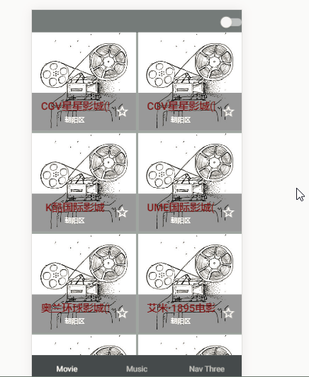

# Movie

> A Vue.js project

## 电影栏
<figure class="third">
    
    
    
    
    
    
    
</figure>


``` bash
# install dependencies
npm install

# serve with hot reload at localhost:8080
npm run dev

# build for production with minification
npm run build
```

For detailed explanation on how things work, consult the [docs for vue-loader](http://vuejs.github.io/vue-loader).
